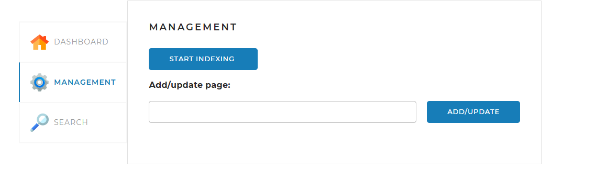
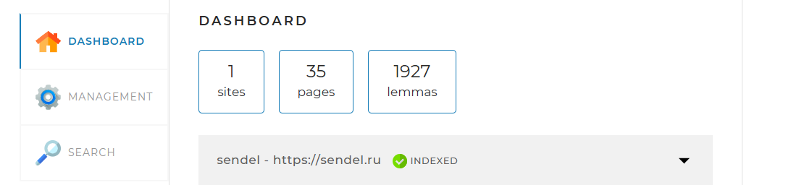
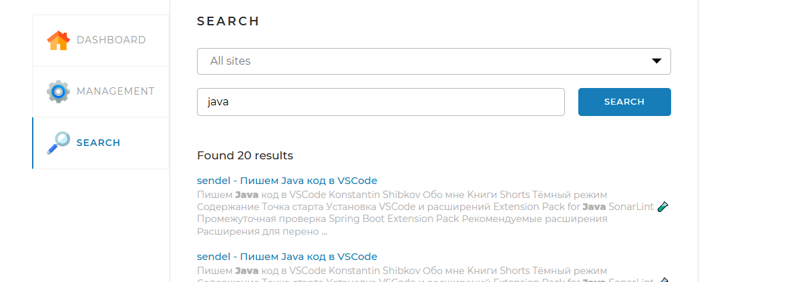

в application.yaml установить нужные сайты для поиска
например : 
indexing-settings:
sites:
- url: https://url.ru
name: url
- url 2
- name 2

У указать логин и пароль для доступа к БД    
username: root
password: root

После запуска на вкладке management нажать start index

Когда все сайты проиндексированы, это видно на вкладке dashboard

После можно проводить поиск по ключевым словам на вкладке 
search
